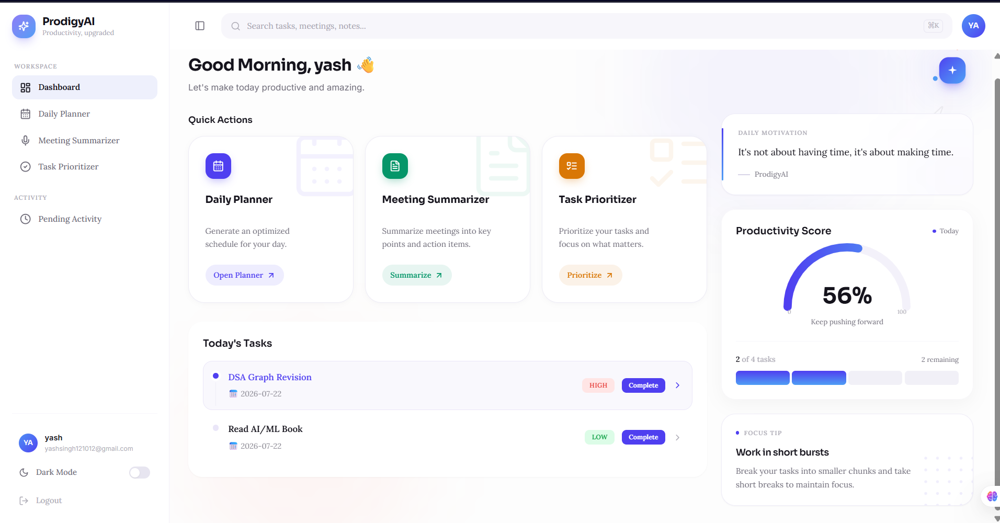
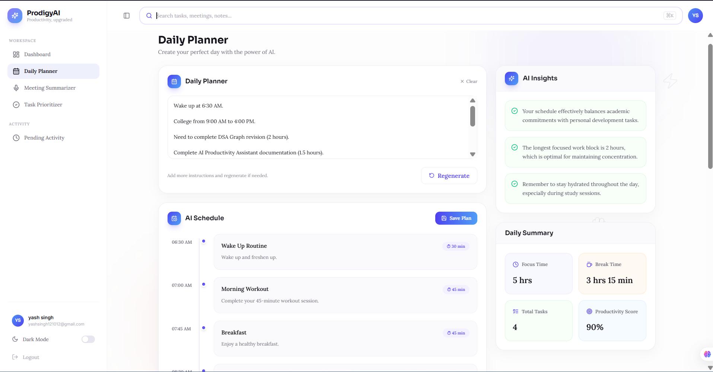
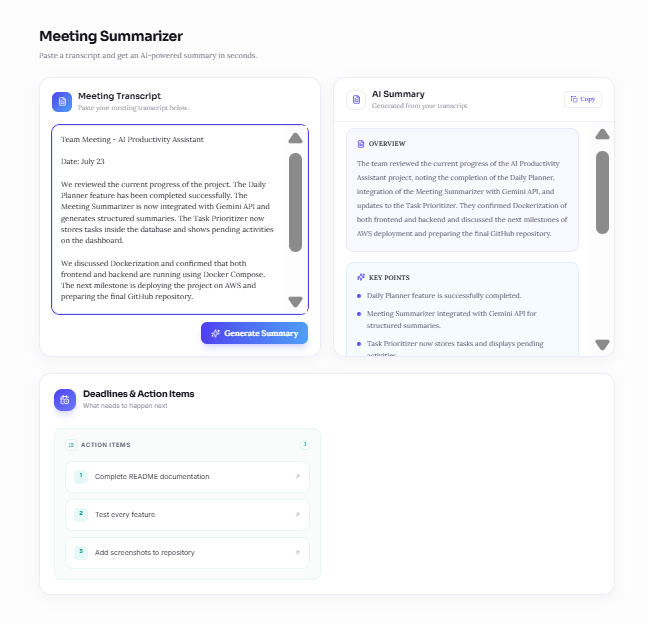
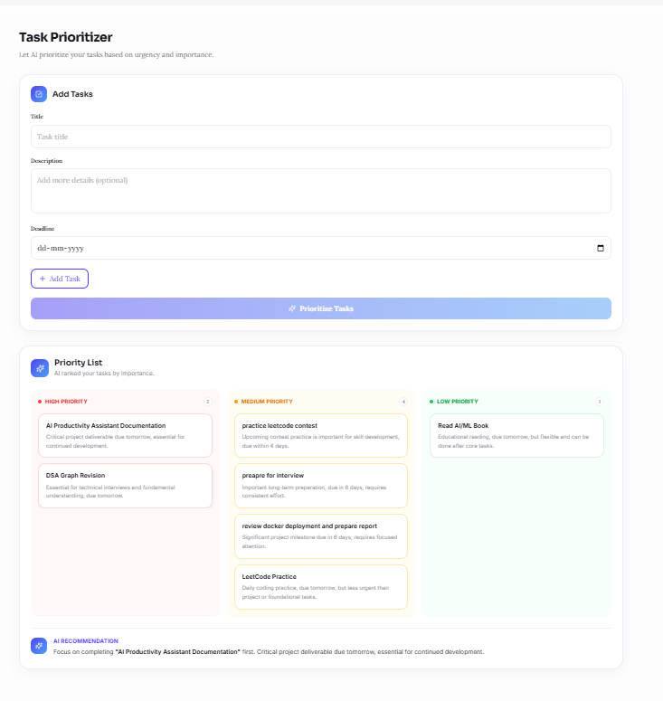

<div align="center">

#  ProdigyAI

### AI-Powered Productivity Platform

*Plan your day, prioritize tasks, summarize meetings, and manage everything from a single dashboard.*

[](https://reactjs.org/)
[](https://fastapi.tiangolo.com/)
[](https://ai.google.dev/)
[](https://www.sqlite.org/)
[](https://www.docker.com/)
[](https://jwt.io/)

[](#)
[](#)
[](#)

[Live Demo](https://ai-productivity-assistant-iota.vercel.app/) • [Features](#-features) • [Tech Stack](#-tech-stack) • [Architecture](#-architecture) • [Getting Started](#-getting-started) • [Screenshots](#-screenshots)


</div>

---

## 📖 About

**ProdigyAI** combines intelligent AI workflows with persistent task management to help you take control of your day. Instead of a one-off AI demo, every generated task lives inside a real dashboard you can track, update, and complete.

Built with **React, FastAPI, Google Gemini, SQLite, SQLAlchemy, JWT Authentication,** and **Docker**.

---

## ✨ Features

<table>
<tr>
<td width="50%" valign="top">

### 🗓️ AI Daily Planner
- Generates a personalized daily schedule using Google Gemini
- Creates structured time blocks with task descriptions
- Saves planner tasks directly to the dashboard
- Prevents duplicate planner entries

</td>
<td width="50%" valign="top">

### 📌 AI Task Prioritizer
- Accepts multiple user tasks
- AI prioritizes based on urgency and importance
- Automatically assigns High / Medium / Low priority
- Stores prioritized tasks for future tracking

</td>
</tr>
<tr>
<td width="50%" valign="top">

### 📝 AI Meeting Summarizer
- Summarizes meeting transcripts using Google Gemini
- Extracts:
  - 🔎 Meeting Overview
  - 🧩 Key Points
  - ✅ Decisions
  - 🎯 Action Items
- Converts action items into manageable tasks

</td>
<td width="50%" valign="top">

### ✅ Persistent Task Management
- Secure, user-specific task storage
- Dashboard for today's tasks
- Complete / delete / update priority
- Progress tracking across Planner, Prioritizer & Summarizer

</td>
</tr>
</table>

### 📊 Productivity Dashboard
| | |
|---|---|
| 📋 Pending task management | 📈 Daily progress indicator |
| ✔️ Completed task tracking | ⏰ Overdue task handling |
| 🏷️ Priority-based organization | 🔄 Unified task database |

### 🔐 Authentication & Security
- JWT-based authentication
- Secure login & signup
- Protected routes
- User-specific task isolation

### 🐳 Docker Support
- Dockerized frontend & backend
- Docker Compose configuration
- Ready for AWS deployment

---

## 🛠 Tech Stack

| Layer | Technologies |
|---|---|
| **Frontend** | React · Vite · Tailwind CSS · Framer Motion |
| **Backend** | FastAPI · SQLAlchemy · SQLite · Pydantic |
| **AI** | Google Gemini API · Prompt Engineering |
| **Auth** | JWT · Passlib · OAuth2 |
| **Deployment** | Docker · Docker Compose · AWS App Runner |

---

## 🏗 Architecture

```
                        React Frontend
                              │
                              ▼
                       FastAPI Backend
                              │
            ┌─────────────────┼─────────────────┐
            │                 │                 │
            ▼                 ▼                 ▼
     Google Gemini API   SQLite Database   JWT Authentication
            │                 │
            └────────────┬────┘
                          ▼
              Productivity Dashboard
```

---

## 📷 Screenshots

<div align="center">

| Home | Dashboard |
|:---:|:---:|
|  |  |

| AI Planner | AI Task Prioritizer |
|:---:|:---:|
|  |  |

</div>

---

## 🚀 Getting Started

### 1️⃣ Clone the Repository

```bash
git clone https://github.com/yourusername/prodigyai.git
cd prodigyai
```

### 2️⃣ Backend Setup

```bash
cd backend

python -m venv venv

source venv/bin/activate
# Windows
venv\Scripts\activate

pip install -r requirements.txt

uvicorn app.main:app --reload
```

### 3️⃣ Frontend Setup

```bash
cd frontend

npm install
npm run dev
```

### 🐳 Or Run Everything with Docker

```bash
docker compose up --build
```

---

## ⚙️ Environment Variables

Create a `.env` file inside the `backend` directory:

```env
GEMINI_API_KEY=your_api_key
SECRET_KEY=your_secret_key
ALGORITHM=HS256
ACCESS_TOKEN_EXPIRE_MINUTES=60
```

---

## 🗺️ Roadmap

- [ ] 🔍 Search across saved tasks
- [ ] 📅 Calendar integration
- [ ] 📧 Email reminders
- [ ] 🔁 Recurring tasks
- [ ] 👥 Team collaboration
- [ ] 📊 AI productivity analytics

---

## 👩‍💻 Author

<div align="center">

**Swati Singh**

B.Tech Computer Science (2023–2027) · AI & Machine Learning Enthusiast

[](#)


</div>

---

<div align="center">

⭐ If you find this project useful, consider giving it a star!

</div>
